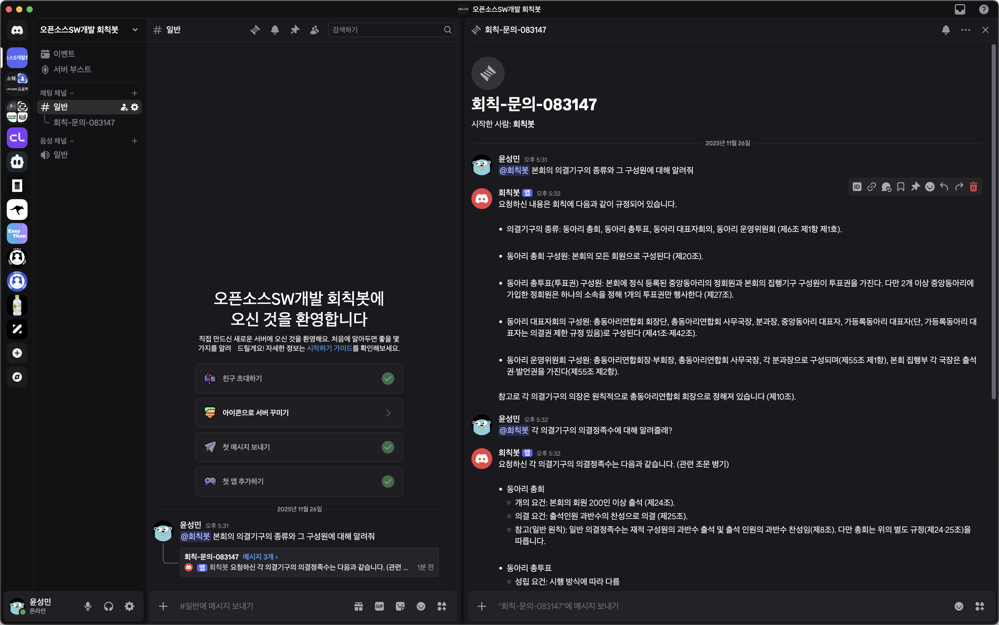
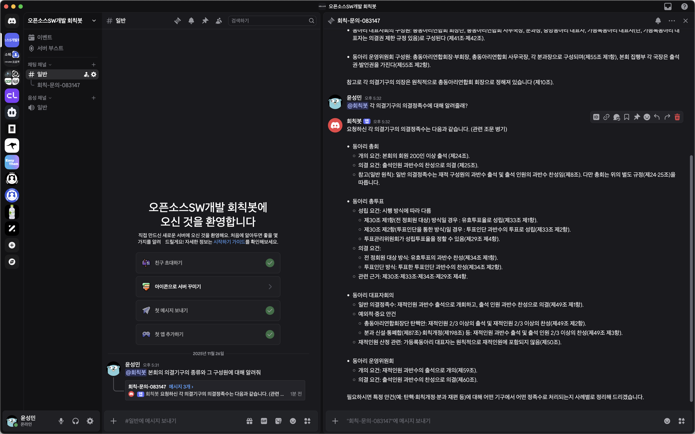

# 회칙봇

단국대학교 총동아리연합회 회칙에 대한 질문에 답하는 디스코드 봇입니다.

## 사용 기술

- Spring Boot
- Spring AI
- Java Discord API (JDA)

## 호출 방식

- `@회칙봇 [질문 내용]` 의 형태로 호출할 수 있습니다.
- 채널에서 호출 시 새로운 스레드를 자동으로 생성하고 답변합니다.
- 스레드에서 호출 시 최근 30개 메시지를 참고하여 답변을 생성합니다.

## 스크린샷

